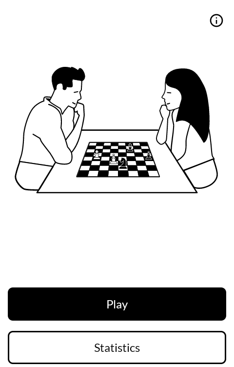
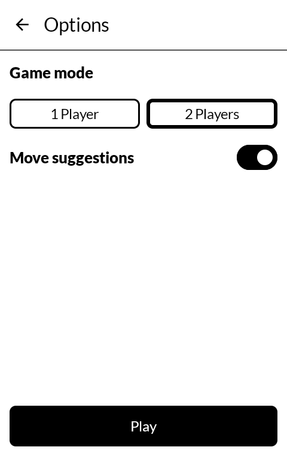
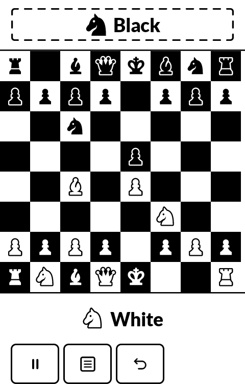

# Chess+

Chess for the [Mudita Kompakt](https://mudita.com/products/kompakt/), against the computer or
against the person across the table.

| | |
|---|---|
|  |  |
|  |  |

## What it does

- Play the computer, as White or Black, at fourteen strengths from about 500 Elo to about
  2150. The engine is Fairy-Stockfish, and it runs on the phone.
- Or play another person on one phone, passing it back and forth between moves. Undo takes
  back one move, whoever made it.
- Move suggestions mark where a piece can go once you pick it up. They can be turned off,
  before a game or during one.
- A move is not played until you confirm it, so a slip of the thumb costs nothing.
- Take moves back, including after the game has ended. A checkmate can be undone and the
  game played on from before it, which is most of what studying a line is.
- The result sits where the turn is shown, not over the board, so the position that decided
  the game stays in view.
- It keeps the game you were in the middle of. Leave the app or turn the phone off and the
  game is there when you come back.
- New game and Exit in the pause menu end the game you are playing, so each asks with a
  second tap.
- Statistics count wins, draws and losses against the computer, and which colour you played.
  Two-player games are not counted; they are not yours to win or lose alone.
- No permissions and no network. Nothing leaves the phone. See [PRIVACY.md](PRIVACY.md).

## Where it comes from

Chess+ began as Mudita's own Chess app for the Kompakt, which Mudita published at
[mudita/MuditaOS-K-Chess-opensource](https://github.com/mudita/MuditaOS-K-Chess-opensource).
The board, the pieces, the engine levels, the statistics and most of the code are theirs. What
is added here is the second player, undo after a finished game, the result moved off the
board, and the interface rebuilt on Mudita's public [MMD](https://github.com/mudita/MMD)
library in place of a private one, so that anyone can build it.

It installs alongside the Chess app the phone came with, under its own application id
(`com.wanderwildwood.chessplus`), and does not replace it.

## Getting it, and keeping it

Download <https://github.com/wanderwildwood/MuditaOS-K-Chess-opensource/releases/latest/download/chessplus.apk>
and sideload it. That address always points at the newest release, and every release
publishes a `.sha256` beside the APK if you would rather check than trust.

For updates without doing this by hand, add this repository to
[Obtainium](https://github.com/ImranR98/Obtainium):

    https://github.com/wanderwildwood/MuditaOS-K-Chess-opensource

It will offer each new release as it appears. **The application id is settled**: updates
install over what you have, keeping your games, statistics and settings.

A copy older than 1.3.3 was signed with a different key. Android will not update it, and
stops with `INSTALL_FAILED_UPDATE_INCOMPATIBLE`; uninstall it first. That clears its
statistics and does not touch the phone's own Chess app.

## Licence

GPL-3.0-only. See [LICENSE.md](LICENSE.md).

Mudita's repository carries no licence file of its own. The app it builds bundles
[Fairy-Stockfish](https://github.com/fairy-stockfish/Fairy-Stockfish) 14, by Fabian Fichter and
the Stockfish developers, under the GPL version 3 or later, and an app distributed with it is
distributed under the GPL as a whole. Version 3 is the version taken here. The engine's
source is in `library/chess-engine-bin`, and the app runs the engine built from it.

[chesslib](https://github.com/bhlangonijr/chesslib) (Apache 2.0) checks the moves, and
[MMD](https://github.com/mudita/MMD) (Apache 2.0) draws the interface.

## Building

Needs the Android SDK, and the NDK if you are rebuilding the engine.

```sh
./gradlew testDebugUnitTest
./gradlew :app-android:assembleRelease
./gradlew :library:chess-engine-bin:copyBinaries   # only to rebuild the bundled engine
```

Release builds are signed with a keystore in `signing/`, which is gitignored. There is no
fallback: without it `assembleRelease` produces an unsigned APK, which will not install
anywhere. A signing key in a public repository is not a signing key, and a missing one should
stop a release rather than produce something installable. `assembleDebug` works without it,
signed with the usual Android debug key.

The version is in `gradle/libs.versions.toml`, name and code both.

`docs/` has Mudita's notes on how the project is laid out and how the engine is built and
spoken to.
